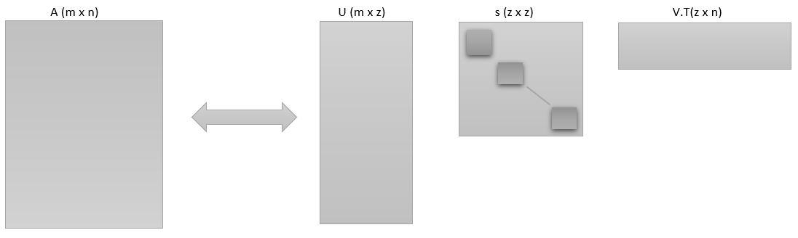

# Introduction

We all share the same love towards Data Science, and really knows the importance of the dataset what algorithm it is? which learning it is?, data is really important for us. Simple predictive and information-rich data is always loved by everyone. But at the same time everyone really hates the data cleaning and all kinds of stuff and in addition to that if the data is not predictive or like meaningless to for the model then its like a nightmare to everyone.

Also sometimes the high dimensionality makes the thing more complex and computations more worse. So to deal with higher dimensions in the datasets we need to do the Dimensionality Reduction (I mentioned this term in Simplifying Word Vectors). So there are many ways to deal with dimensions like Principal Component Analysis, CUR decomposition, and Singular Value decomposition(SVD). So I am writing this blog for SVD as here too I got some problems with understanding this, though SVD and CUR Decomposition is similar just CUR Decomposition is preferred for low-rank matrices.

Ok so!! after reading this article what you will know??
1. How higher dimensional dataset affects the model
2. What is a dimension reduction
3. What is SVD
4. How SVD reduces the dimensions of the dataset

# Content
1. The behavior of the Dataset
2. Dealing with the redundant data and how it affects the models
3. SVD and its representation
4. Reducing the dimensions
5. Further Reading
6. Post Reading

---

## The behavior of the Dataset

<b>Dataset is just the like data which exists due to some action or activity of something</b>
Above is my understanding for the dataset :) though it is something just came in my mind you can understand dataset as 
 <b>A collection of related sets of information that is composed of separate elements but can be manipulated as a unit by a computer.</b>

It is basically the multidimensions data with multiple rows and multiple columns. Our whole foundation of the model is depending on the dataset.

  

## Dealing with the redundant data and how it affects the models

As I mentioned in the introduction the Dataset cleaning is a really crucial task, and if the dataset has some non-predective entries or meaningless entries then its like a cherry on a cake:) (it,s sarcasm by the way). So if the data has some non-predictive value or less contribution towards some specific direction then we can neglect it for the reduction. But it will definitely affect the model.

Some redundant data can be harmful like in case it will not contribute towards the model training but it will give its negative contribution by adding noise in it and reduce the noise quality and predictive  accuracy.

Let me explain it with some examples so we have data of all the startups in the decade(2010 - 2020) and it has some columns as Name, Place, and Year of Establishment and we have plenty of entries in the dataset. Now in that dataset let us assume a large quantity of the entries are redundant and as a developer, we don't know what those values are we just treat them as null entries but if they all are from the same year then while representing data there is a huge decrement in the graph and that's not ethically right it will add noise in the model when that data is used to train the model. 

I hope from this example you understand why redundant or null data is harmful to the model.

  

## SVD and its representation

singular value decomposition or SVD is like bone data engineers to deal with redundant or null data in the dataset. SVD is the way of breaking up a matrix into 3 pieces. So every rectangular matric can be factorized into 3 factors so let them generally called as U, Ʃ, and V.T(V.T represents the transpose of matrix V). I used here generalized notations so for this explanation lets call Ʃ as s matrix ok... 

So according to the SVD we can write as 

A = U * s * V.T

And here U is the orthogonal matrix S is the diagonal matrix and V.T is also a diagonal matrix or physically can understand it as rotation stretching and rotation. So you can visualize these matrices as follows.

I think no need to explain this figure 

so it is important to understand the <b>s</b> matrix is a diagonal matrix and we can see it as just a scaling factor but <b>s</b> matrix is the most important matrix in the decomposition.

So when matrix A (m x n) decomposes into U (m x z), s (z x z) and V.T (z x n) you can see that U is the matrix with the same shape as that of A.
And s(z x z) matrix is the diagonal matrix with element [σ1, σ2, σ3, ...]
and σ1 >= σ2 >= σ3 ... > 0. σ1 is always associated with the first column of U and the first row of V.T. And so the product of the first column of U, σ1 and the first row of V.T has the more importance in describing the matrix A than the second column and so onn.

## Reducing the dimensions

So we are at the final task that is reducing the dimensions of the A before that let me show with an example of an image, how increasing dimensions will improve the image quality. 

So I took an image (2732 x 2732) pixels into a matrix and apply SVD on it and then again plot that image for σ = 5, 20, 100, 1000, 2732. We will see how the image will improve its quality as we increase the value of σ. And then we will see how to reduce the dimensions

So I took an image (2732 x 2732)

convert it into grayscale

Apply SVD and get U, s, V.T matrices and plot the image for

σ = 5,
You can clearly state that this is a picture of the bloomed flower 

σ = 20,
By increased value of σ the quality of image improved  

σ = 100, Now petals and other inner filaments can be clearly seen 

σ = 1000,its almost like original picture 

σ = 2732, original picture. 

One thing that is important to conclude is by increasing value of σ the quality has improved but at the larger values very less quality difference is observed like for σ = 1000 and σ = 2792 the pictures are similar so as the value of σ increases there is no much difference in quality as σ1 >= σ2 >= σ3 ... > 0
So I checked the value of σ at 2732 and it came out to be 
6.537536187615815e-13 = 6.53 x 10^-13. It's quite a gigantically small value.

With this small value, σ does not contribute in that direction so as σ increases the quality improvement decreases. <b>And that's the one of the important conclusion for the SVD</b>

So if I retain only 2000 values for the forward operation I will get the 98% similar results also my calculation will reduce with a considerable amount. So that's the importance of dimensionality reduction. 

### So how many dimensions we should use???
So, there is a rule for retaining the dimensions which states retain enough singular values to make up 90% of the energy in s
* So what is energy???
  * That is the sum of the squares of the retained singular values.

So with this, I hope you have enough understanding for SVD and Dimensionality Reduction

## Further Reading

It,s nice if you want to read more about SVD and Dimensionality Reduction

* Free Materials
    -  Dr. Steve Brunton is the Professor at the University of Washington he has a really nice channel on Data-Driven approach for Data Science you can visit it [here](https://www.youtube.com/channel/UCm5mt-A4w61lknZ9lCsZtBw) 

    - For Linear Algebra and more insides about SVD, there is no better than Dr. Gilbert Strang watch his free lectures here [here](https://www.youtube.com/watch?v=7UJ4CFRGd-U&list=PLE7DDD91010BC51F8)

    - For practice on SVD and other Dimensionality Reduction try [this](http://infolab.stanford.edu/~ullman/mmds/ch11.pdf) from Standford Infolab

## Post Reading acknowledged :)

Thank you so much for reading this, please give me feedback on this on my [mail](viragumathe5@gmail.com)

