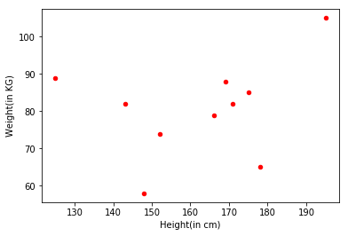

# Introduction 

Actually I am working on Natural Language Processing now a days and going through many terms which are new to me and it takes me lot of time to understand properly and get through it. So I thought there are many developers who may face this problem so I am just putting my understanding here in simpler ways :) 

So let's move on towards the word to vector. But its not like you snap your fingers and woshhhhh!!!!! word just converted to vector and you will know whole algorithm for it, so lets just be calm and read with patience. 
So initially we will go through some concepts.

# Content
1. Vectors
2. vector space
3. Why word to vec
4. What we can do with word vectors
5. Distributional Semantics in sentence
6. Word to Vectors
5. Dimentation Reduction 
6. Creating your own word vector
---

## Vectors 
The quenty which possess both magnitude as well as direction, this how we define a vector but in computer science some things changes and these are some of the simple definations present on web you will easily get this defination by 2 or 3 clicks of surfing.
1. In computer programming, a vector is either a pointer or an array with only one dimension.
2. In computer graphics, a line that is defined by its start and end point.

So, simplyfying the meaning of the Vector and it can be represented as:
 
*Vectors simply are the datapoints having more than one values. In data science to be specific that values may be a coordinated set like in the form of __(m, n)__*

## Vector Space 
A set of multiple vectors or Space consisting of multiple vectors which are associated with commulative, associative property of vector addition. And disributive operations of vectors multiplication. 

## Why Word to Vec

In NLP we really play with the words, from their formation to their contexts so for that we need some menthod to do the transaction between vectors but the problem is, we have a great system to do the transaction between the numbers but we are not able to do the math with words like we dont know what will we get after doing __lion + tiger__. So there we need some mathematical methods which will do these transaction for us thet's where we need __word vectors__. Once we get the word vectors then we can add them sutract them or do whatever we want.

## What we can do with word vectors
For explaination please refer following table.

|Person | Height | Weight|
|:-----:|:------:|:-----:|
|A      |125     |89     |
|B      |143     |82     |
|C      |166     |79     |
|D      |175     |85     |
|E      |178     |65     |
|F      |148     |58     |
|G      |169     |88     |
|H      |171     |82     |
|I      |195     |105    |
|J      |152     |74     |

So here we have  table which shows the height and weight of 10 pesons so that we can relate the relation between two persons in simpler ways. We cannot state any relation between these persons. But whe we have this information about them we can campare and state some relation between these person (This example is totally imaginary and just for good understanding please dont relate it with word vectors)
  
we can plot this table as 

now from this information we can relate the persons.

## Distributional Semantics in Sentence
Sematic are the smallest entity of the sentence they are complete in their own. Each consists of their own meaning and context for the sentence.

Actually the [Distributional Semantic](https://en.wikipedia.org/wiki/Distributional_semantics) is the specialized area for the picking of the semantic similarities in the corpus.
There is one base for the Distributional Semantic which is Distributional Hypothesis and it states

<b>
Linguistic items with similar distributions have the simila meaning
</b>

Linear algebra, computtional tools and visualization framework helps Distributional Semantics.

## Word to Vectors
So let's see for what we are here so according to the the Distributional Hypothesis lets try to make a system which will converts words to vectors by counting context.

Firstly we are taking the window of three words and for a contaxt of previous one and next one word for the vector.

So I have a very famous dialogue from the Infinity War 

<b>
"Part of the journey is the end"
</b>

so now let's have a big spreadsheet which has every row's as a word from the dialogue and column for every possible context.

| Word   | START...of | Part...the | of...journey | the...is | journey...the | is...end | the...END |
|:------:|:----------:|:----------:|:------------:|:--------:|:-------------:|:--------:|:---------:|
|Part    |1           |0           |0             |0         |0              |0         |0          |
|of      |0           |1           |0             |0         |0              |0         |0          |
|the     |0           |0           |1             |0         |0              |1         |0          |
|journey |0           |0           |0             |1         |0              |0         |0          |
|is      |0           |0           |0             |0         |1              |0         |0          |
|end     |0           |0           |0             |0         |0              |0         |1          |

The spreadsheet represents the vector for the word the word and their vectors are as follows

| Word   | Vector               |
|:------:|:--------------------:|
|Part    |[1, 0, 0, 0, 0, 0, 0] |
|of      |[0, 1, 0, 0, 0, 0, 0] |
|the     |[0, 0, 1, 0, 0, 1, 0] |
|journey |[0, 0, 0, 1, 0, 0, 0] |
|is      |[0, 0, 0, 0, 1, 0, 0] |
|end     |[0, 0, 0, 0, 0, 0, 1] |

There are presently 7 context in the above sentences thats why we are dealing with seven dimentations here. Seven dimentations is not a big deal for the vector arithmetics.

But while dealing with the large corpus there must be a high dimentations to deal with so there are two possibilities which are 
1. Increasing the computation power
2. Reducing the Dimentation 

But increasing the computation power is not that fisible for the solution so there comes the term __Dimentation Reduction__.

## Dimentation Reduction
So, [Dimentation Reduction](https://en.wikipedia.org/wiki/Dimensionality_reduction) is the process of reduction of the dimentations in the vector bascally it is a process of leminating the random variables. There many algorithms for Dimentation Reduction as 
1. Feature Selection
2. Feature Projection 
 
and many more.

## Creating your own word vector
To be honest its really bad task to create your own vectors but still if you want to do so you know the process now selecting the window and check the context and all.

Otherwise The Stanford Provides their own datasets for pre-trained vectors 
[Global Vectors for Word Representation (GloVe).](https://nlp.stanford.edu/projects/glove/)

----
## Thank You For Reading

You can search for different applications on word vectors and you will get innumrous results.
I was really worried about the word to vec as I barely understad anything about it and thats why I keep in fear about NLP.

I really thnkful to [Allison Parrish](http://www.decontextualize.com/) who wrote a wounderful explanation on word vectors. If you understand the word vectors clearly and want to go more deeper I really would like to reffer this [notebook](https://gist.github.com/aparrish/2f562e3737544cf29aaf1af30362f469)

For keeping this simple I did not wrote any coding part here as it is really needed to understand it first. 
I am working on another text which will take through the coding part in its simplest.

Please feel free to give feedback 

Thank You
